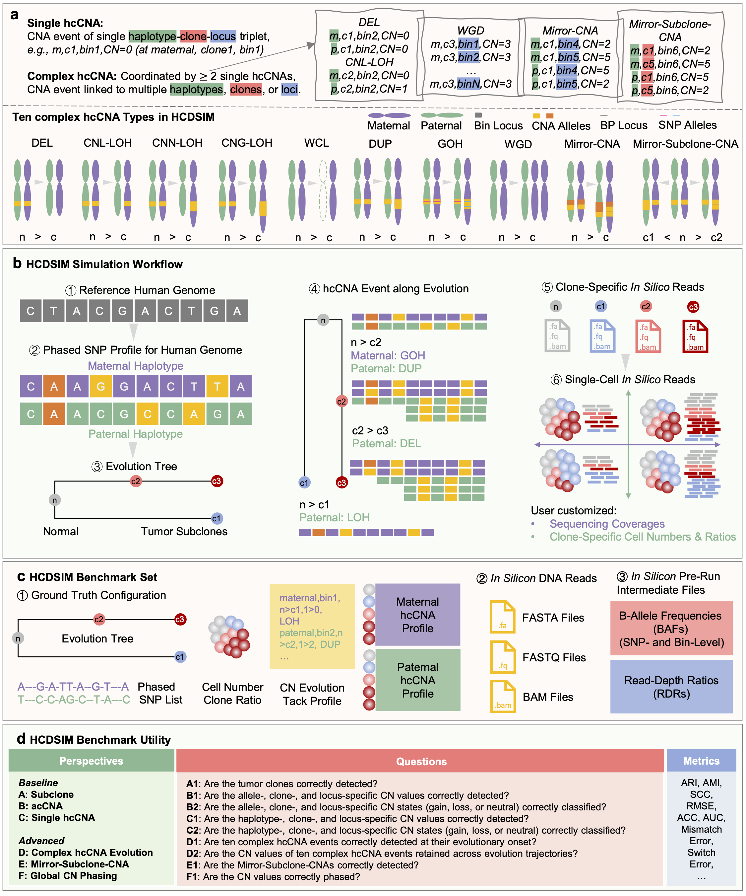

[](https://github.com/xikanfeng2/hcdsim/stargazers)
[](https://pypi.org/project/hcdsim/)
[](https://pepy.tech/project/hcdsim)
[](https://hcdsim.readthedocs.io)

# HCDSIM: A Single-Cell Genomics Simulator with Haplotype-Specific Copy Number Annotation.

```{note}
This project is under active development.
```

HCDSIM: A Single-Cell Genomics Simulator with Haplotype-Specific Copy Number Annotation.



* Discuss development on [Github].
* Get started by browsing {doc}`tutorials <tutorials>`.

```{toctree}
:hidden: true
:maxdepth: 1

tutorials
release-notes
contributors
references
```

[Github]: https://github.com/xikanfeng2/HCDSIM
