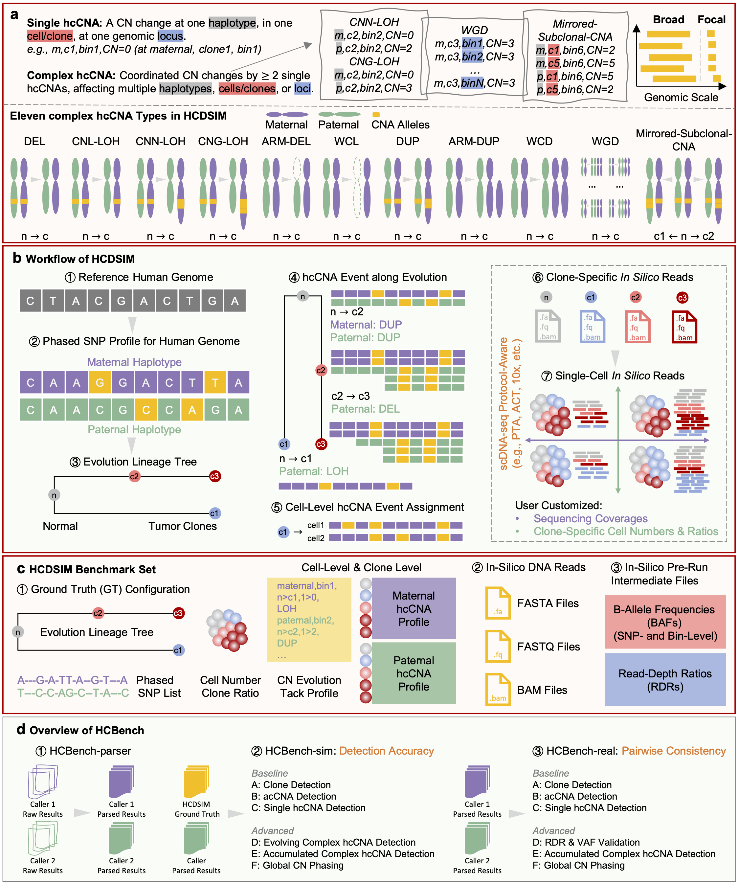

# Tutorials

## Contents ##

1. [Overview](#overview)
2. [Installation](#setup)
    - [Creation of python virtual env](#env)
    - [Standard installation](#standard)
    - [Custom installation](#custom)
    - [Dependencies](#depend)
3. [Usage](#usage)
    - [Required data](#requireddata)
    - [Commands](#hcdsim-commands)
    - [Class](#hcdsim-class)
    - [Outputs](#outputs)

<a name="overview"></a>
## Overview



HCDSIM models ten distinct complex hcCNA events, which are classified into three categories based on their genomic impact: copy-number (CN) loss, CN gain, and mirror-like reciprocal events (above figure). CN-loss-associated events include deletions (DEL; i.e., 0|0), where both alleles are lost. Loss of heterozygosity (LOH), defined as the loss of one parental allele, can occur in three distinct forms: LOH with copy number loss (CNL-LOH), where the remaining allele has a copy number of one (i.e., 1|0); copy-number neutral LOH (CNN-LOH), where one allele is lost while the other remains with a copy number of two (i.e., 2|0), preserving a normal total copy number but still exhibiting LOH; and copy-number gain LOH (CNG-LOH), where the remaining allele has a copy number above two (e.g., 3|0, 4|0). Whole-chromosome loss (WCL) results in the complete loss of a chromosome, affecting multiple loci simultaneously.CN gain-related hcCNAs primarily fall into three categories: duplication (DUP) is the most common form of CN gain, where a genomic region is duplicated; gain of heterozygosity (GOH), an increase in different alleles due to extra copies, potentially facilitating adaptation by introducing new mutations; and whole genome doubling (WGD), where the entire genome is duplicated, promoting chromosomal instability and tumor evolution by affecting multiple loci simultaneously.Additionally, mirror-like hcCNAs involve reciprocal CN swaps, either across loci (mirror-CNAs) or across subclones (Mirror-Subclone-CNAs). An example of mirror-CNA is two genomic bins (A and B) may have CN(A)=1 and CN(B)=2 in one haplotype, while in the other haplotype, the copy numbers are reversed, with CN(A)=2 and CN(B)=1. Similarly, in Mirror-Subclone-CNAs, two tumor subclones (c1 and c2), the copy numbers of a genomic region may be CN(c1)=1 and CN(c2)=3 in one haplotype, while in the other haplotype, the values are reversed, with CN(c1)=3 and CN(c2)=1. These events collectively capture the diverse genetic alterations driving tumor evolution.

<a name="setup"></a>
## Installation

[HCDSIM](https://hcdsim.readthedocs.io/en/latest/index.html) is distributed as a [PyPI](https://pypi.org/project/HCDSIM/) package, and can be installed either from pip or directly from source.

<a name="env"></a>
### Creation of python virtual env

We recommend creating a virtual environment to run the HCDSIM(This step is optional!). You can use the following command to create a virtual python env:

```shell
# create a python virtual env in scsilicon2 folder
python3 -m venv my_env

# activate the virtual env
source path-to-my_env/bin/activate

# deactivate the virtual env
deactivate
```

Also, you can create virtual env with `Conda`. 

```shell
# create a python virtual env in scsilicon2 folder
conda create --name myenv python=3.11

# activate the virtual env
conda activate myenv

# deactivate the virtual env
conda deactivate
```

<a name="standard"></a>
### Standard installation

HCDSIM can be installed using an existing installation of `pip`.

```shell
pip install hcdsim
```

<a name="custom"></a>
### Custom installation

To clone the repository and install manually, run the following from a terminal:

```shell
git clone https://github.com/xikanfeng2/HCDSIM.git
cd HCDSIM
python setup.py install
```

<a name="depend"></a>
### Dependencies

HCDSIM is written in `python3` and requires few standard python packages and several additional standard tools.

#### > Python packages

HCDSIM depends on the following standard python packages, which must be available in the python environment where the user runs HCDSIM. These Python packages will be automatically installed when you install hcdsim.

| Package | Tested version | Comments |
|---------|----------------|----------|
| [numpy](https://numpy.org/) | 2.1.0 | Efficient scientific computations |
| [pandas](https://pandas.pydata.org/) | 2.2.2 | Dataframe management |
| [scipy](https://scipy.org/) | 1.13.1 | Statistical distributions and optimization |
| [matplotlib](https://matplotlib.org/) | 3.9.1 | Basic plotting utilities |
| [networkx](https://networkx.org/) | 3.3 | Drawing cell-lineage tree |
| [scikit-learn](https://scikit-learn.org/) | 1.3.0 | Benchmark utilities |
| [pyfaidx](https://github.com/mdshw5/pyfaidx) | 0.9.0.3 | FASTA file indexing and reading |


#### > Additional software

HCDSIM also requires few standard additional tools, which should be included in `PATH` (e.g. by executing `export PATH=${SAMTOOLS_HOME}/bin/:${PATH}`). You can also specify the path to these tools by passing it as an argument, such as `--samtools`.

| Software | Tested version | Comments |
|----------|----------------|----------|
| [wgsim](https://github.com/lh3/wgsim) | 1.13 | Wgsim is a small tool for simulating sequence reads from a reference genome. |
| [SAMtools and BCFtools](http://www.htslib.org/doc/)  | 1.13 | Suite of programs for interacting with high-throughput sequencing data. |
| [bwa](http://bio-bwa.sourceforge.net/)  | 0.7.17-r1188 | Alignment of DNA sequencing reads. |
| [bedtools](https://bedtools.readthedocs.io/en/latest/)  | v2.31.1 | bedtools: a powerful toolset for genome arithmetic. |


<a name="usage"></a>
## Usage

1. [Required data](#requireddata)
2. [Commands](#hcdsim-commands)
3. [Class](#hcdsim-class)
4. [Outputs](#outputs)

<a name="requireddata"></a>
### Required data

HCDSIM requires 3 input data:

1. **A reference genome file with fasta format (required).**  The most-used human reference genome are available at [GRC](https://www.ncbi.nlm.nih.gov/grc/human) or [UCSC](https://hgdownload.soe.ucsc.edu/downloads.html). Moreover, the reference genome `${REF}.fa` must be index by SAMtools (i.e. `samtools faidx ${REF}.fa`) and a dictionary must be created (`i.e. samtools dict ${REF}.fa > ${REF}.dict`) in the same folder as `${REF}`. 

2. **A list of known germline SNPs (optional).** This list is optional and SNPs can be introduced in arbitrary positions of the genome. However, we strongly suggest to obtain the list from known databases. One of the most used database of germline SNPs is [dbSNP](https://genome.ucsc.edu/cgi-bin/hgTables?hgsid=2388304805_pDcvxm8EAdslKzcosQNlKBXZWgUG&clade=mammal&org=Human&db=hs1&hgta_group=varRep&hgta_track=hub_3671779_censat&hgta_table=0&hgta_regionType=genome&position=chr9%3A145%2C458%2C455-145%2C495%2C201&hgta_outputType=primaryTable&hgta_outFileName=) and the common germline SNPs can be downloaded from the most recent realease [here](https://www.ncbi.nlm.nih.gov/variation/docs/human_variation_vcf/). In order to consider only a subset of the positions to reduce the number of SNPs, the user should sample only some of the positions in this list according to estimated frequency of SNPs (typically 1 SNP every 1000 genomic positions along the entire genome. HCDSIM requires the list to be given in a tab-separate file with the following fields:

| Field | Comment |
|-------|---------|
| `CHR` | Name of a chromosome, required to be present also in the reference genome |
| `POS` | A genomic position corresponding to a germline SNP in `CHR` |
| `REF_ALLELE` | Allele of the reference genome in `POS` |
| `ALT_ALLELE` | Alternate allele of the germline SNP in `POS` |

An example of this list is given [here](https://github.com/xikanfeng2/HCDSIM/blob/main/example/dbsnp.tsv). If this file is not provided, HCDSIM will randomly introduce SNPs into the reference genome based on the snp-ratio parameter.

3. **A list of contig to exclude (optional).** This list is optional but highly reccomended. This is a list containing all the contigs in the given reference genome that should be excluded. An example of this list is given [here](https://github.com/xikanfeng2/HCDSIM/blob/main/example/ignore.txt). HCDSIM requires the list to be given in a file with every excluded contig in a new line.

<a name="hcdsim-commands"></a>
### HCDSIM Commands

HCDSIM offers different sub commands to run either the entire pipeline with all the steps or only some specific steps. In particular, the latter commands are useful when user wants to re-run some specific steps by varying some of the default parameters. Every sub-command can be run directly when HCDSIM has been correctly installed, such as `hcdsim sim`.

```{note}
The complete HCDSIM pipeline will sequentially execute the following modules in order: gprofile -> gfasta -> gfastq -> align -> downsam -> pbam -> bcbam|rdr|baf. If you want to re-run one of these steps, please make sure the previous commands have been successfully executed.
```

```{note}
Click on the name of each command to obtain a description of all the available parameters.
```

| SubCommand | Description | Required input |
|--------------|-------------|----------------|
| [sim](man/hcdsim-sim.md) | Running the complete HCDSIM pipeline | a reference genome file |
| [gprofile](man/hcdsim-gprofile.md) | Generating CNA profile | a reference genome file |
| [gfasta](man/hcdsim-gfasta.md) | Generating clone FASTA file | One or more running directories of previous runs of `gprofile` |
| [gfastq](man/hcdsim-gfastq.md) | Generating clone FASTQ file | One or more running directories of previous runs of `gfasta` |
| [align](man/hcdsim-align.md) | Aligning clone FASTQ file | One or more running directories of previous runs of `gfastq` |
| [downsam](man/hcdsim-downsam.md) | Downsampling clone BAM | One or more running directories of previous runs of `align` |
| [pbam](man/hcdsim-pbam.md) | Processing cell BAMs | One or more running directories of previous runs of `downsam` |
| [bcbam](man/hcdsim-bcbam.md) | Generating barcode BAM file | One or more running directories of previous runs of `pbam` |
| [rdr](man/hcdsim-rdr.md) | Computing RDRs | One or more running directories of previous runs of `pbam` |
| [baf](man/hcdsim-baf.md) | Computing BAFs | One or more running directories of previous runs of `pbam` |

<a name="hcdsim-class"></a>
### HCDSIM Class

In addition to HCDSIM commands, HCDSIM also provides the HCDSIM class, allowing users to import HCDSIM for use in the Python console. The following is an example of using the HCDSIM class in the Python console.


```Python
from hcdsim import HCDSIM

# init HCDSIM object with params
hcdsim = HCDSIM(ref_genome='hg38.fa', clone_no=10, cell_no=100)

# equivalent to the hcdsim sim subcommand
hcdsim.sim()

# equivalent to the hcdsim gprofile subcommand
hcdsim.gprofile()

# equivalent to the hcdsim gfasta subcommand
hcdsim.gfasta()

# equivalent to the hcdsim gfastq subcommand
hcdsim.gfastq()

# equivalent to the hcdsim align subcommand
hcdsim.align()

# equivalent to the hcdsim downsam subcommand
hcdsim.downsam()

# equivalent to the hcdsim pbam subcommand
hcdsim.pbam()

# equivalent to the hcdsim bcbam subcommand
hcdsim.bcbam()

# equivalent to the hcdsim rdr subcommand
hcdsim.rdr()

# equivalent to the hcdsim baf subcommand
hcdsim.baf()
```

The parameters supported by the HCDSIM class are the same as those supported by the HCDSIM command. Below are all the supported parameters. 

```Python
class HCDSIM:
    def __init__(self, 
                ref_genome: str, 
                snp_list: str = None, 
                ignore: str = None, 
                outdir: str = './', 
                genome_version: str = 'hg38',
                clone_no: int = 2, 
                cell_no: int = 2, 
                tree_alpha: float = 10.0, 
                tree_beta: float = 10.0, 
                max_tree_depth: int = 4, 
                tree_depth_sigma: float = 0.5, 
                max_node_children: int = 4, 
                tree_balance_factor: float = 0.8,
                tree_newwick: str = None,
                tree_mode: int = 0,
                random_seed: int = None,
                bin_size: str = '100kb', 
                snp_ratio: float = 0.001, 
                thread: int = None, 
                heho_ratio: float = 0.67, 
                cna_prob: float = 0.02,
                del_prob: float = 0.2,
                cna_copy_param: float = 0.5,
                weights: Optional[List[float]] = None,
                lambdas: Optional[List[int]] = None,
                clone_coverage: float = 30, 
                cell_coverage: float = 0.01, 
                reads_len: int = 150, 
                insertion_size: int = 350, 
                error_rate: float = 0.02, 
                wgd: bool = False,
                chrom_cna_no: int = 2,
                chrom_arm_rate: float = 0.75,
                loh_cna_no: int = 15, 
                goh_cna_no: int = 5, 
                unique_ratio: float = 0.5,
                barcode_len: int = 12,
                lorenz_x: float = 0.5,
                lorenz_y: float = 0.35,
                window_size: int = 200000,
                correlation_len: int = 10,
                max_ploidy: int = None,
                max_cna_value: int = 10,
                wgsim: str = 'wgsim', 
                samtools: str = 'samtools', 
                bwa: str = 'bwa', 
                bedtools: str = 'bedtools',
                bcftools: str = 'bcftools'):
```

<a name="outputs"></a>
### HCDSIM Outputs

The command `hcdsim sim` runs the entire HCDSIM pipeline starting from the required reference genome. During the executiong, the command creates eight folders which contain the temporary and final outputs produced by the each step of HCDSIM.


```markdown
## Output Files

### `profile` folder

This folder contains all files related to CNA profiles, generated by the `hcdsim gprofile` command. The outputs include both **clone-level** and **cell-level** CNA information.

#### Clone-level files

##### `clone_cna_profile.csv`

A CSV dataframe containing the haplotype-specific CNAs for each clone.

| Column | Description |
|--------|-------------|
| `Chromosome` | The chromosome name |
| `Start` | The start position of bin (1-based) |
| `End` | The end position of bin |
| `normal`, `clone1`, `clone2`, ... | The allele-specific CNAs formatted as `maternal\|paternal` (e.g., `1\|1`, `3\|0`) |

##### `clone_maternal_cna_matrix.csv` and `clone_paternal_cna_matrix.csv`

CSV matrices containing the haplotype-specific CNAs for maternal and paternal genomes respectively. Rows represent genomic bins, columns represent clones.

##### `clone_changes.csv`

A CSV dataframe recording all CNA events during clonal evolution.

| Column | Description |
|--------|-------------|
| `Parent` | The parental clone |
| `Child` | The child clone |
| `Haplotype` | `maternal` or `paternal` |
| `Type` | Type of CNA event |
| `Segment` | The genomic region (e.g., `chr16:68200001-70200000`) |
| `Length` | The genomic region length (e.g., `2000000`) |
| `Change` | Detailed copy number change (e.g., `1->3`) |

Example:

```csv
Parent,Child,Haplotype,Type,Segment,Length,Change
normal,clone2,paternal,CNN_LOH,chr13:47600001-56300000,8700000,1->2
normal,clone2,maternal,CNG_LOH,chr13:58900001-60200000,1300000,1->0
normal,clone2,paternal,CNG_LOH,chr13:58900001-60200000,1300000,1->3
normal,clone2,maternal,DEL,chr13:68500001-70200000,1700000,1->0
normal,clone2,paternal,DEL,chr13:68500001-70200000,1700000,1->0
normal,clone2,maternal,CNG_LOH,chr13:72000001-72900000,900000,1->6
```

##### `mirrored_subclonal_cnas.csv`

A CSV dataframe containing all mirrored subclonal CNAs across clones.

| Column | Description |
|--------|-------------|
| `Chromosome` | The chromosome name |
| `Start` | The start position of bin |
| `End` | The end position of bin |
| `Clone1` | The first clone with mirrored CNA |
| `Clone2` | The second clone with mirrored CNA |
| `Clone1_CNA` | The CNA of Clone1 (e.g., `2\|1`) |
| `Clone2_CNA` | The CNA of Clone2 (e.g., `1\|2`) |

---

#### Cell-level files

##### `cell_cna_profile.csv`

A CSV dataframe containing the haplotype-specific CNAs for each cell.

| Column | Description |
|--------|-------------|
| `Chromosome` | The chromosome name |
| `Start` | The start position of bin (1-based) |
| `End` | The end position of bin |
| `normal_cell1`, `normal_cell2`, ... | The allele-specific CNAs for each cell |

##### `cell_maternal_cna_matrix.csv` and `cell_paternal_cna_matrix.csv`

CSV matrices containing the haplotype-specific CNAs for maternal and paternal genomes at the cell level. Rows represent genomic bins, columns represent cells.

##### `cell_changes.csv`

A CSV dataframe mapping each cell to its corresponding clone and CNA changes.

Example:
```csv
Clone,Cell,Haplotype,Type,Segment,Length,Change
normal,normal_cell42,maternal,DEL,chr2:166600001-166900000,300000,1->0
normal,normal_cell42,paternal,DEL,chr2:166600001-166900000,300000,1->0
normal,normal_cell42,maternal,DUP,chr5:10200001-20200000,10000000,1->3
normal,normal_cell42,paternal,DUP,chr5:10200001-20200000,10000000,1->3
normal,normal_cell42,maternal,DEL,chr1:165600001-166000000,400000,1->0
normal,normal_cell42,paternal,DEL,chr1:165600001-166000000,400000,1->0
normal,normal_cell42,maternal,CNL_LOH,chr15:93300001-94900000,1600000,1->0
normal,normal_cell42,maternal,CNN_LOH,chr7:106700001-139700000,33000000,1->0
normal,normal_cell42,paternal,CNN_LOH,chr7:106700001-139700000,33000000,1->2
```

#### SNP and phasing files

##### `snp_phases.csv`

A CSV dataframe containing all phased SNPs inserted into the reference genome.

| Column | Description |
|--------|-------------|
| Column 1 | Chromosome |
| Column 2 | Position (1-based) |
| Column 3 | Reference allele |
| Column 4 | Alternative allele |
| Column 5 | Phase (`0\|1` or `1\|0`) |

In the phasing notation, `0` represents the reference allele and `1` represents the alternative allele.

Example:

```csv
chr1,844308,C,A,1|0
chr1,849963,A,G,1|0
chr1,850556,A,G,1|0
chr1,851587,C,A,1|0
chr1,852718,T,A,1|0
chr1,855396,G,A,0|1
chr1,857116,A,C,1|0
```

#### Tree and reference files

##### `tree.newick`

The cell-lineage tree in Newick format.

##### `tree.json`

The cell-lineage tree in JSON format for programmatic access.

##### `tree.pdf`

Visualization of the cell-lineage tree.

##### `barcodes.txt`

A text file listing all cell barcodes, one per line.

##### `reference.csv`

A CSV dataframe containing genomic bin information for the reference genome.

#### `fasta` folder

This folder contains all maternal and paternal fasta files for all clones.

#### `fastq` folder

This folder contains all maternal and paternal fastq files for all clones.

#### `clone_bams` folder

This folder contains all BAM files for all clones, such as `normal_maternal.bam`, `normal_paternal.bam`.

#### `cell_bams` folder

This folder contains all BAM files for all cells in each clone, such as `normal_cell1.bam`, `clone1_cell1.bam`.

#### `barcode_bam` folder

This folder contains barcode bam generating from all cell bams.

#### `rdr` folder

This folder contains RDR matrix and coverage matrix of all cells.

#### `baf` folder

This folder contains BAF matrix and allele frequency matrix of all cells.

#### `log` folder

This folder contains all log files for all HCDSIM steps. 

1. `hcdsim_log.txt`: the log information generated by HCDSIM piepline.
2. `samtools_log.txt`: the log information generated by samtools.
3. `bwa_log.txt`: the log information generated by bwa.
4. `wgsim_log.txt`: the log information generated by wgsim.
5. `bcftools_log.txt`: the log information generated by bcftools.
6. `bedtools_log.txt`: the log information generated by bedtools.
7. `barcode_bam_log.txt`: the log information generated by `hcdsim bcbam` command.

#### `tmp` folder

This folder contains all temporary files for all HCDSIM steps.

[Github]: https://github.com/xikanfeng2/HCDSIM/tree/main/datasets/hcCNA-bench-large/profile
[Benchmark]: https://github.com/xikanfeng2/HCDSIM/tree/main/datasets/hcdbench-example-data/
